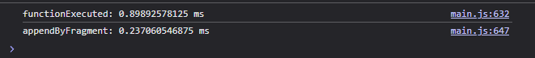
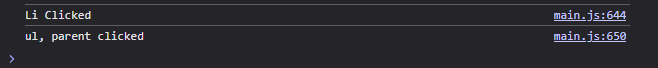
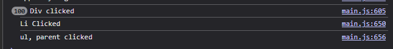

# 📌 Week 1 – DOM & JavaScript Foundation

## 🎯 Objective
Tuần này tập trung vào **củng cố kiến thức cơ bản về DOM tree và JavaScript thao tác DOM**.  
Sau khi hoàn thành, dev phải:
- Hiểu được DOM là gì, các loại node phổ biến, và cách DOM tree được tổ chức.  
- Thao tác được với DOM thông qua API chuẩn.  
- Viết được các bài tập nhỏ chứng minh khả năng thao tác DOM.

---

## 📝 Requirements

### 1. Kiến thức cần nắm
- DOM tree:
  - Document node, Element node, Text node, Comment node.
  - Phân biệt Node vs Element.
- DOM API cơ bản:
  - Truy xuất: `getElementById`, `querySelector`, `querySelectorAll`.
  - Tạo/Xóa: `createElement`, `appendChild`, `removeChild`.
  - Chỉnh sửa: `setAttribute`, `textContent`, `innerHTML`.
  - Di chuyển trong DOM: `firstChild`, `nextSibling`, `parentNode`, `childNodes`.
- Event cơ bản:
  - `addEventListener`.
  - Event bubbling vs capturing.
  - Event delegation.

### 2. Bài tập bắt buộc
- [ X ] **Bài 1:** Tạo một danh sách `<ul>` từ một mảng dữ liệu JS.  
- [ X ] **Bài 2:** Thêm mới và xóa phần tử `<li>` trong danh sách bằng button.  
- [ X ] **Bài 3:** Sử dụng event delegation để xử lý click trên từng `<li>` (không gắn listener cho từng item).  
- [ X ] **Bài 4:** Render 1000 item vào DOM và so sánh hiệu năng giữa:
  - Thêm trực tiếp từng item vào DOM. --> 1.921875 ms
  - Dùng `DocumentFragment` để tối ưu. --> 0.55712890625 ms
  - 
- [ X ] **Bài 5:** Viết ví dụ sử dụng bubbling và capturing để log event order.
   - Bubbling trong event handler la viec ma cac ham handler (ham xu ly su kien) se duoc thuc hien theo thu tu tu phan tu con -> phan tu cha -> toi DOM:
   
   - Capturing trong event handler la viec ma cac ham handler (ham xu ly su kien) se duoc thuc hien khong theo thu tu noi bot thong thuong nua ma element duoc captrue se thuc hien truoc roi moi toi thu tu noi bot -> toi DOM (Thu tu tu element duoc capture -> con duoc capture -> khi het capture thi toi noi bot )
   - 
 - --> Mở rộng hơn là vì sao khi click vào phần tử trên cùng thì lại chạy 100 dòng lệnh console?
 - Vì khi click thì sự kiện được chạy là sự kiện của của element div, trong đó có 100 thẻ li nên khi click vào 1 li -> sự kiện đó sẽ được truyền lên ông nội là div, và div sẽ phải thực hiện xác định xem đâu là phần tử xảy ra sự kiện nên mỗi lần lặp sẽ tạo ra 1 function từ đó sinh là 100 dòng log.
---

## 📂 Deliverables
- Thư mục `week1/` chứa:
  - `index.html` (có phần root để render).
  - `script.js` (toàn bộ logic).
  - `README.md` (ghi chú cách chạy, kết quả mong đợi).
- Code phải có **comment giải thích ngắn gọn** (tối đa 2–3 dòng / function).
- Bài tập phải có **screenshot hoặc mô tả kết quả** trong README.

---

## ✅ Acceptance Criteria
- Dev giải thích được các loại node trong DOM tree.  
- Code chạy đúng, không lỗi console.  
- Bài 4 chứng minh rõ sự khác biệt hiệu năng (console log thời gian render).  
- Event delegation trong Bài 3 hoạt động khi thêm mới phần tử.  
- README đầy đủ, leader khác clone repo có thể chạy ngay.  

---

## ⏰ Deadline
- Toàn bộ task phải hoàn thành và push lên repo trước **Thứ 7, 23:59 – Tuần 1**.  
- Review sẽ được thực hiện vào Chủ Nhật.  
